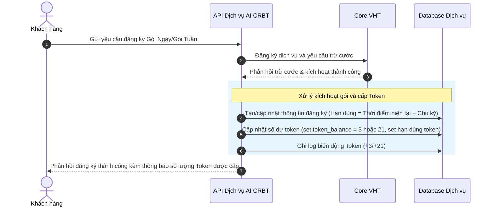
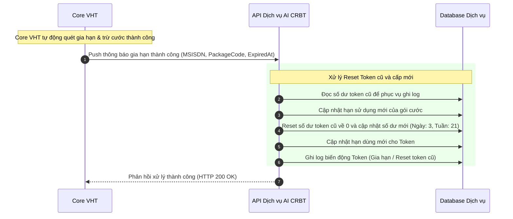

# TÀI LIỆU YÊU CẦU NGHIỆP VỤ & LẬP TRÌNH (SRS)
## DỊCH VỤ AI CRBT (COLOR RING BACK TONE AI) - HỆ THỐNG GÓI CƯỚC & QUẢN LÝ TOKEN

---

## 1. Giới Thiệu
Tài liệu này mô tả yêu cầu lập trình (yêu cầu nghiệp vụ và logic hệ thống) để triển khai tính năng quản lý gói cước và phân bổ **Token** cho dịch vụ nhạc chờ AI CRBT. Dịch vụ cung cấp cho người dùng các gói cước để sử dụng tính năng tạo/tùy chỉnh nhạc chờ bằng AI (mỗi lần tạo nhạc chờ hoặc nghiệp vụ liên quan sẽ tiêu tốn một lượng Token nhất định).

---

## 2. Thông Tin Chi Tiết Gói Cước

Hệ thống cung cấp 2 gói cước cơ bản: **Gói Ngày (Daily)** và **Gói Tuần (Weekly)**.

| STT | Tên Gói | Chu Kỳ Sử Dụng | Token Phân Phổ Khi Đăng Ký | Token Phân Bổ Khi Gia Hạn | Nguyên Tắc Hạn Sử Dụng Token |
|:---:|:---|:---:|:---:|:---:|:---|
| 1 | **Gói Ngày** | 24 giờ kể từ thời điểm đăng ký / gia hạn thành công | **3 Token** | **3 Token** | Token chỉ có giá trị sử dụng trong chu kỳ hiện tại. Hết chu kỳ, Token chưa dùng hết sẽ bị reset về 0 và cộng mới. |
| 2 | **Gói Tuần** | 7 ngày kể từ thời điểm đăng ký / gia hạn thành công | **21 Token** | **21 Token** | Token chỉ có giá trị sử dụng trong chu kỳ hiện tại. Hết chu kỳ, Token chưa dùng hết sẽ bị reset về 0 và cộng mới. |

---

## 3. Logic Nghiệp Vụ Quản Lý Token (Token Lifecycle)

### 3.1. Cơ Chế Reset & Cộng Mới Token (Bắt Buộc)
Token được liên kết chặt chẽ với chu kỳ của gói cước. Khi xảy ra sự kiện kết thúc chu kỳ (Hết hạn hoặc Gia hạn):
1. **Trước khi gia hạn / cộng mới**: Số lượng Token hiện tại trong tài khoản của thuê bao đối với gói cước tương ứng phải được **Reset về 0** (Xóa bỏ toàn bộ Token cũ chưa sử dụng).
2. **Sau khi gia hạn / cộng mới thành công**: Cộng số lượng Token tương ứng của chu kỳ mới (`+3` đối với Gói Ngày, `+21` đối với Gói Tuần).
3. *Không có cơ chế cộng dồn (roll-over)* Token từ chu kỳ này sang chu kỳ khác.

### 3.2. Quản Lý Trạng Thế Thuê Bao (Subscription States)

#### A. Đăng ký mới (Subscribe)
* **Điều kiện**: Thuê bao chưa sử dụng gói hoặc đã hủy gói hoàn toàn.
* **Hành động**: 
  * Trừ cước gói thành công.
  * Thiết lập hạn sử dụng gói (Ví dụ: Gói ngày = `Thời điểm hiện tại + 24h`; Gói tuần = `Thời điểm hiện tại + 7 ngày`).
  * Cộng số Token tương ứng vào tài khoản Token của khách hàng (Ngày: 3, Tuần: 21).

#### B. Gia hạn chủ động / tự động (Renew)
* **Điều kiện**: Khi nhận được thông báo gia hạn thành công từ hệ thống Core (nhà mạng/charging).
* **Hành động**:
  * Cập nhật hạn sử dụng mới cho gói cước.
  * **Reset số dư Token cũ về 0**.
  * Cộng số dư Token mới của chu kỳ tiếp theo (Ngày: 3, Tuần: 21).

#### C. Hủy dịch vụ (Unsubscribe)
* Khi khách hàng gửi yêu cầu hủy gói cước, hệ thống viễn thông sẽ xử lý hủy đồng bộ ngay lập tức và chuyển trạng thái gói cước sang **Hủy hoàn toàn (`CANCELLED`)**.
* **Bảo lưu Token nhưng tạm khóa quyền sử dụng**: 
  * Hệ thống **vẫn giữ nguyên số dư Token cũ và thời gian hết hạn của lượng token đó** (ngày hết hạn của Token đã được thiết lập từ chu kỳ trước).
  * **Tuy nhiên, khách hàng không được phép sử dụng lượng Token này để thực hiện tác vụ AI khi gói cước đã bị hủy (`CANCELLED`)**.
  * Lượng token cũ này chỉ có thể được sử dụng lại thông qua cơ chế **cộng dồn** khi khách hàng thực hiện đăng ký gói cước mới (đăng ký lại hoặc đổi gói) thành công trước khi lượng token cũ này hết hạn.
  * Nếu khách hàng không đăng ký gói mới và để hết thời hạn cũ, số dư Token chưa dùng sẽ tự động bị reset về 0 (bởi tiến trình quét quá hạn).

### 3.3. Quy Định Đăng Ký và Chuyển Đổi Gói Cước
1. **Nguyên tắc tính thời gian hết hạn (Expired_at)**: 
   * Hạn sử dụng của gói cước (`expired_at`) và token (`token_expired_at`) được tính chính xác theo thời điểm đăng ký/gia hạn thực tế của khách hàng (giờ:phút:giây). 
   * **Không áp dụng cơ chế làm tròn đến cuối ngày (23:59:59)**. 
   * *Ví dụ*: Đăng ký Gói Ngày lúc 14:35:10 ngày 03/06 -> Hạn dùng là 14:35:10 ngày 04/06.
2. **Chính sách Đăng ký Đè (Chặn Đăng ký trùng / Đăng ký gói khác khi đang dùng)**:
   * Khi thuê bao đang có gói cước ở trạng thái **Kích hoạt (ACTIVE)**:
     * **Chặn đăng ký lại chính gói đó**: Khách hàng không được đăng ký lại gói cước hiện tại (Hệ thống sẽ báo lỗi/trả tin nhắn thông báo đã đăng ký gói).
     * **Chặn đăng ký gói khác**: Khách hàng không thể đăng ký gói cước khác trực tiếp (ví dụ từ Gói Ngày đăng ký sang Gói Tuần hoặc ngược lại). Hệ thống sẽ chặn giao dịch và báo lỗi.

3. **Quy trình Chuyển đổi Gói cước (Tối ưu lợi ích Khách Hàng)**:
   * Để chuyển đổi gói cước (ví dụ từ Ngày -> Tuần), khách hàng bắt buộc phải thực hiện **Hủy gói cước cũ trước**.
   * **Hành động Hủy gói cũ**: Khi khách hàng gửi yêu cầu hủy gói cũ, hệ thống viễn thông sẽ xử lý hủy đồng bộ ngay lập tức và cập nhật trạng thái gói cũ thành **Hủy hoàn toàn (`CANCELLED`)**. Tuy nhiên:
     * **Vẫn giữ nguyên số dư Token cũ và ngày hết hạn cũ** của lượng token đó trong DB nhưng khóa quyền sử dụng.
   * **Hành động Đăng ký gói mới**: Khi khách hàng thực hiện đăng ký thành công gói cước mới:
     * Hệ thống kiểm tra số dư token cũ còn lại (nếu thời hạn token cũ chưa hết).
     * Thực hiện **cộng dồn** số dư token cũ đó vào định mức token được cấp của gói cước mới.
     * Cập nhật hạn sử dụng mới (`token_expired_at` và `expired_at`) của toàn bộ lượng token sau khi cộng gộp theo chu kỳ gói cước mới.

### 3.4. Logic Trừ Token khi Thực Hiện Tác Vụ (Tạo Nhạc Chờ AI)
Để đảm bảo chặt chẽ về mặt tài chính và tài nguyên hệ thống, quy trình trừ token hoạt động theo nguyên tắc **Trừ trước - Thực hiện sau**:
1. **Kiểm tra & Trừ trước**: Khách hàng yêu cầu thực hiện tác vụ AI CRBT -> Hệ thống kiểm tra số dư. Nếu đủ token, hệ thống lập tức thực hiện trừ token trước và bắt đầu chạy tác vụ AI.
2. **Quyền lợi khi hết hạn giữa chừng**: Một khi token đã được trừ thành công để bắt đầu tác vụ, thì **cho dù gói cước hoặc token bị hết chu kỳ/hết hạn trong lúc tác vụ AI đang xử lý (tác vụ chạy ngầm mất thời gian), tác vụ vẫn được tiếp tục thực hiện và trả kết quả file nhạc chờ thành công cho khách hàng**.
3. **Bù / Hoàn trả Token (Token Compensation/Refund)**: 
   * Trường hợp tác vụ AI bị lỗi (hệ thống lỗi, không tạo được nhạc chờ thành công hoặc lỗi hạ tầng), hệ thống tự động hoàn trả (hoặc bộ phận CSKH bù thủ công) số lượng token tương ứng lại tài khoản của thuê bao.
   * **Nguyên tắc thời hạn**: Token được bù/hoàn trả vẫn phải **tuân thủ đúng thời hạn sử dụng của chu kỳ gói cước hiện tại** (có `token_expired_at` bằng ngày hết hạn chu kỳ gói cước hiện hành của thuê bao). Token này sẽ bị reset về 0 nếu hết chu kỳ hiện tại mà chưa sử dụng.

---

## 4. Luồng Logic Xử Lý (Sequence Flows)

### 4.1. Luồng Cộng Token Khi Đăng Ký Mới

### 4.2. Luồng Gia Hạn Gói Cước (Nhận Thông Báo từ Core VHT)

### 4.3. Cơ Chế Quét Hết Hạn Token (Tránh Trùng Lặp hoặc Sót)
Hệ thống cần một tiến trình ngầm (Daemon / Cronjob) chạy định kỳ để quét các tài khoản Token đã quá hạn sử dụng mà không nhận được thông báo gia hạn (ví dụ gói cước đã bị hủy hoặc gia hạn thất bại tại Core VHT).

**Mô tả xử lý quét reset token hết hạn:**
* Tìm các thuê bao có thời gian hết hạn của token (`token_expired_at`) nhỏ hơn hoặc bằng thời điểm hiện tại và có số dư token lớn hơn 0.
* Đặt số dư Token của các thuê bao này về 0.
* Ghi nhận log biến động token (Lý do: Token quá hạn chu kỳ).

---

## 6. Kịch Bản Kiểm Thử QA (Test Cases / Verification Checklist)

| ID | Tác Nhân / Kịch Bản | Trạng Thái Ban Đầu | Hành Động | Kết Quả Mong Đợi (Cả DB & Client) |
|:---|:---|:---|:---|:---|
| **TC01** | Đăng ký Gói Ngày | Thuê bao chưa có gói, token_balance = 0 | Đăng ký thành công gói ngày | - Tạo gói cước thành công với hạn dùng `Hiện tại + 24h`.  - Số dư Token được đặt là **3**. - Có log `SUB_CREDIT` với giá trị `+3` trong bảng log. |
| **TC02** | Đăng ký Gói Tuần | Thuê bao chưa có gói, token_balance = 0 | Đăng ký thành công gói tuần | - Tạo gói cước thành công với hạn dùng `Hiện tại + 7 ngày`. - Số dư Token được đặt là **21**. - Có log `SUB_CREDIT` với giá trị `+21` trong bảng log. |
| **TC03** | Gia hạn Gói Ngày khi còn dư Token | Gói Ngày Active, token_balance = **1**, hạn dùng hết vào 12:00 | Thực hiện gia hạn thành công vào lúc 12:00 | - Hạn dùng gói tăng thêm 24 giờ.  - Số dư Token cũ (1) bị xóa sạch. - Số dư Token mới được đặt lại thành **3** (Không phải cộng dồn thành 4). - Log ghi nhận thao tác gia hạn/reset thành công. |
| **TC04** | Gia hạn Gói Tuần khi đã tiêu hết Token | Gói Tuần Active, token_balance = **0**, hạn dùng hết vào ngày N | Thực hiện gia hạn thành công vào ngày N | - Hạn dùng gói tăng thêm 7 ngày.  - Số dư Token mới được đặt thành **21**. - Log ghi nhận thao tác gia hạn thành công. |
| **TC05** | Hủy dịch vụ giữ quyền lợi đến hết chu kỳ | Gói cước Active, token_balance = **2**, hạn dùng còn 5 giờ | Thực hiện hủy gói cước | - Trạng thái gói cước lập tức chuyển sang hủy hoàn toàn `CANCELLED`. - **Vẫn giữ nguyên số dư 2 Token và hạn dùng cũ (còn 5 giờ) trong DB nhưng tạm khóa quyền sử dụng**. - Khách hàng yêu cầu sử dụng tác vụ AI -> Hệ thống báo lỗi/từ chối do gói cước đã hủy. - Khi hết 5 giờ, tiến trình quét reset token quá hạn chạy và cập nhật token_balance về **0**. |
| **TC06** | Reset Token do quá hạn (Hết chu kỳ không gia hạn được) | Gói cước đã kết thúc, hệ thống gia hạn lỗi, token_expired_at < NOW, token_balance = **2** | Tiến trình Daemon/Cronjob quét định kỳ chạy | - Hệ thống tự động đặt số dư Token về **0**. - Ghi log giao dịch loại `RESET_EXPIRED` trừ đi 2 Token. |
| **TC07** | Chuyển đổi gói cước (yêu cầu hủy trước) | Gói Ngày Active, token_balance = **2**, hạn dùng còn 5 giờ | Gửi lệnh đăng ký Gói Tuần | - Hệ thống chặn và báo lỗi (do chưa hủy gói Ngày). - Khách hàng thực hiện hủy gói Ngày -> Trạng thái chuyển sang `CANCELLED` ngay lập tức, **giữ lại 2 token và hạn dùng cũ trong DB (nhưng tạm khóa)**. - Gửi lại lệnh đăng ký Gói Tuần thành công -> Kích hoạt gói Tuần thành công. - Số dư Token mới được cộng dồn và mở khóa: **2** (cũ) + **21** (mới) = **23 Token**. - Hạn dùng mới của 23 Token được thiết lập chính xác là `Thời điểm đăng ký gói tuần + 7 ngày` (không làm tròn ngày). |

| **TC08** | Thực hiện tác vụ AI khi hết hạn giữa chừng | Gói Ngày Active, token_balance = **1**, chu kỳ gói còn 2 phút | Khởi động tác vụ tạo nhạc chờ AI (mất 3 phút xử lý) | - Hệ thống trừ thành công **1 Token** ngay lập tức. - Token_balance về **0**. - Tiến trình tạo nhạc chờ chạy. - Sau 2 phút gói cước hết hạn (đang xử lý). - Sau 3 phút tác vụ trả về file nhạc thành công mà không bị ngắt quãng. |
| **TC09** | Chặn đăng ký trùng chính gói đang sử dụng | Gói Tuần Active | Gửi lệnh đăng ký lại Gói Tuần | - Hệ thống kiểm tra thấy thuê bao đang có Gói Tuần ở trạng thái ACTIVE. - Từ chối đăng ký và trả tin nhắn báo lỗi đã sử dụng dịch vụ. |
| **TC10** | Chặn đăng ký gói khác khi gói hiện tại đang ACTIVE | Gói Ngày Active | Gửi lệnh đăng ký Gói Tuần | - Hệ thống kiểm tra thấy thuê bao đang có Gói Ngày ở trạng thái ACTIVE. - Từ chối đăng ký trực tiếp và trả tin nhắn hướng dẫn hủy gói cũ trước khi chuyển đổi. |

