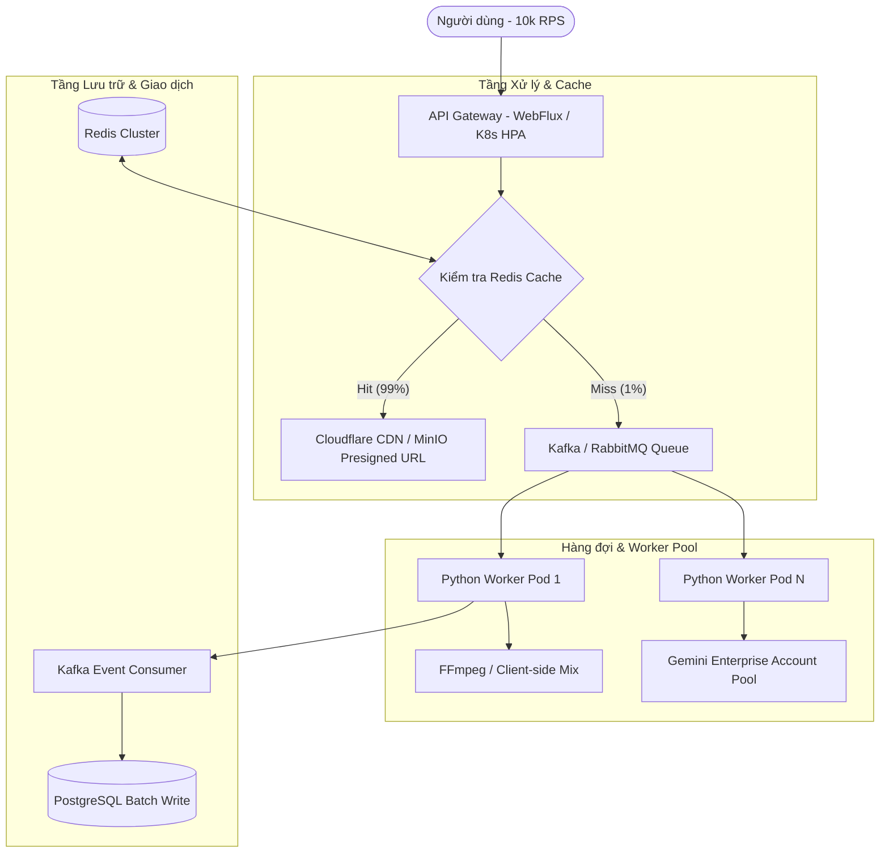

# Kế hoạch Đề xuất Kiến trúc: Đạt 10.000 RPS cho Hệ thống Audio & AI Music

Tài liệu này đề xuất lộ trình công nghệ và các bước chuẩn bị cần thiết để nâng cấp hệ thống Microservice hiện tại đáp ứng mức tải đột biến **10.000 Requests/giây (10k RPS)** đối với các tác vụ nặng như tạo nhạc AI (Gemini Lyria-3) và trộn nhạc DIY.

---

## 1. Phân tích Thách thức Kỹ thuật

Tải trọng **10k RPS** đối với tác vụ AI & Audio mang tính chất hoàn toàn khác biệt so với các hệ thống Web thông thường (như đọc/ghi database đơn giản). Các rào cản lớn nhất gồm:
* **Tính toán CPU cực kỳ nặng:** Lệnh FFmpeg trộn nhạc tiêu tốn tài nguyên CPU rất cao. 10k tiến trình FFmpeg chạy đồng thời sẽ làm sập hàng trăm server CPU thông thường ngay lập tức.
* **Thời gian trễ (Latency) rất cao của AI:** Gọi API Gemini Lyria mất từ 20s đến 60s để sinh nhạc. Không có web server nào duy trì được 10.000 kết nối HTTP đồng bộ mở liên tục trong 1 phút mà không bị cạn kiệt tài nguyên mạng (Socket/Port/RAM).
* **Hạn mức của nhà cung cấp (API Quota Limit):** Google Gemini API không hỗ trợ mức quota 10.000 request sinh nhạc đồng thời trên một tài khoản doanh nghiệp thông thường.

---

## 2. Kế hoạch Hành động & Các bước chuẩn bị (5 Trụ cột)

### Trụ cột 1: Chuyển dịch Kiến trúc từ Đồng bộ sang Bất đồng bộ (Async First)
Không giữ kết nối đồng bộ của User để chờ đợi xử lý nhạc.
* **Mô hình Webhook/Polling:** Tất cả API tạo nhạc (cả AI và DIY) phải chuyển sang dạng nhận request -> Đưa vào hàng đợi -> Trả về `202 Accepted` kèm `jobId` trong < 5ms.
* **Giao tiếp thời gian thực:** Sử dụng hạ tầng **WebSocket Cluster** hoặc **SSE (Server-Sent Events)** kết hợp Redis Pub/Sub để chủ động thông báo cho client khi file nhạc đã mix xong, tránh việc client liên tục gửi request HTTP Get để check trạng thái (gây thêm tải).

### Trụ cột 2: Chiến lược Bộ nhớ đệm & Tiền sản xuất (Caching & Pre-generation)
Để phục vụ được 10k RPS, **99% requests của người dùng phải được đáp ứng từ Cache** thay vì sinh trực tiếp bằng AI.
* **Pre-generation Scheduler:** Xây dựng hệ thống công việc chạy ngầm (cron-job) tự động gọi Gemini Lyria vào các khung giờ thấp điểm để tạo sẵn các mẫu nhạc theo các cặp danh mục phổ biến (Genre + Mood + Instrument).
* **Redis Cluster / Pool:** Lưu trữ các liên kết (URL) file đã tạo sẵn này vào Redis. Khi user yêu cầu, hệ thống chỉ cần bốc ngẫu nhiên một file từ Redis Pool trả về (thời gian xử lý < 2ms).
* **Edge Caching (CDN):** Cấu hình Cloudflare hoặc AWS CloudFront lưu trữ trực tiếp các file MP3/WAV. Client tải file trực tiếp từ CDN đặt tại các quốc gia bản địa, không tải trực tiếp từ dịch vụ MinIO nội bộ để tránh nghẽn băng thông server.

### Trụ cột 3: Giải phóng CPU Mix nhạc về phía Thiết bị Người dùng (Client-Side Mixing)
Đây là bước đột phá giúp giảm tải CPU cho hệ thống máy chủ về 0 đối với tác vụ DIY.
* **Công nghệ:** Sử dụng **Web Audio API** (trên trình duyệt) hoặc tích hợp thư viện **FFmpeg.wasm / Native Audio SDK** trực tiếp vào ứng dụng Mobile (iOS/Android).
* **Cơ chế:** Server chỉ làm nhiệm vụ trả về link file giọng đọc (TTS) và link nhạc nền. Thiết bị của người dùng sẽ tự động tải 2 file này về và thực hiện trộn (mix) âm thanh trực tiếp trên thiết bị của họ trước khi phát.

### Trụ cột 4: Hạ tầng Hàng đợi Tin nhắn và Worker mở rộng tự động (Autoscaling Distributed Workers)
Đối với những tác vụ buộc phải xử lý ở server:
* **Hàng đợi tin nhắn:** Thay thế hàng đợi bộ nhớ (In-memory) của Java bằng **Apache Kafka** hoặc **RabbitMQ Cluster** để làm bộ đệm điều phối tải. Khi có 10.000 request ồ ạt đổ vào, Kafka sẽ lưu trữ an toàn toàn bộ các message này mà không sợ mất mát hoặc ném lỗi tràn bộ nhớ.
* **Autoscaling Workers:** Triển khai các Python Media Worker trên **Kubernetes (K8s)**.
* **Cơ chế KEDA (Kubernetes Event-driven Autoscaling):** Tự động scale số lượng Pods của Python Worker từ 5 lên 500 Pods dựa trên độ dài hàng đợi tin nhắn (lag) của Kafka.
* **Tối ưu hóa Python Worker:** Chuyển đổi logic mix nhạc sang xử lý bất đồng bộ hoàn toàn (`asyncio.create_subprocess_exec`) để không làm khóa Event Loop của FastAPI.

### Trụ cột 5: Quản trị Giao dịch & Cơ sở dữ liệu dưới áp lực lớn
* **Redis Reservation (Trừ ví trước):** Việc kiểm tra và trừ credit của user ở mức 10k RPS không được thực hiện trực tiếp trên DB (PostgreSQL). Sử dụng Redis (Lua script) để trừ số dư tạm thời (Reservation).
* **Batch Database Writes (Ghi theo lô):** Các luồng log lịch sử (`user_lyria_history`) và log giao dịch tiền tệ được gom lại và viết xuống PostgreSQL theo dạng batch (ví dụ: gom 500 bản ghi viết 1 lần bằng Kafka Consumer) thay vì insert từng dòng đơn lẻ gây khóa bảng (Table Lock).
* **PostgreSQL Scaling:** Sử dụng kiến trúc Read/Write Splitting (1 Master để ghi giao dịch, nhiều Replica phục vụ đọc).

---

## 3. Checklist Chuẩn bị Hạ tầng tối thiểu cho 10.000 RPS

| Thành phần | Cấu hình & Giải pháp Đề xuất |
| :--- | :--- |
| **API Gateway** | Tối thiểu 3 Pods (chạy trên K8s), cấp phát tài nguyên tối thiểu 4 Cores CPU / 8GB RAM mỗi Pod. Kèm cơ chế cân bằng tải AWS ALB / Cloudflare. |
| **Redis** | Redis Sentinel hoặc Redis Cluster gồm tối thiểu 3 Node Master - 3 Node Replica để lưu cache nhạc và session ví. |
| **Message Broker** | Cluster Apache Kafka (3 Brokers) chuyên dụng cho việc nhận tác vụ Audio Mix. |
| **Cơ sở dữ liệu** | PostgreSQL chạy trên cấu hình tối thiểu 16 Cores CPU, 64GB RAM, ổ cứng SSD NVMe. Cấu hình connection pool (`HikariCP`) trong các Java service lên 150-200. |
| **External AI Account** | Đàm phán gói doanh nghiệp với Google Cloud để có tài khoản Gemini API với hạn mức tối thiểu **500 - 1.000 RPM (Requests Per Minute)** kết hợp cơ chế quay vòng (rotation) nhiều API Keys. |
| **Mạng & Băng thông** | Đường truyền internet băng thông tối thiểu **10 Gbps** cho máy chủ lưu trữ file (MinIO/S3) nếu không sử dụng CDN. Khuyên dùng CDN để giảm tải băng thông mạng. |
