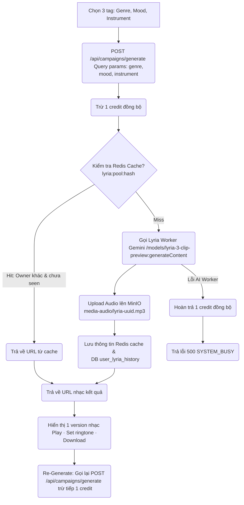
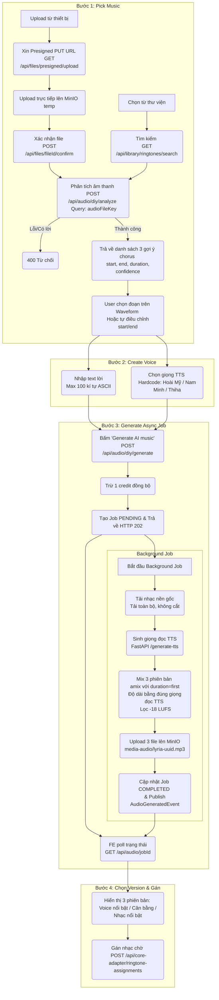

# Phân Tích Logic Luồng Hệ Thống: Ảnh Thiết Kế vs. Source Code Thực Tế

Tài liệu này so sánh chi tiết giữa sơ đồ thiết kế của 2 luồng (**AI CRBT Generator** và **Manual Generator - DIY**) với thực tế cài đặt trong Source Code hiện tại.

---

## Luồng 1 — AI CRBT Generator

### 1. Endpoint & Cách truyền tham số
* **Thiết kế trên ảnh**: 
  * Chọn 3 tag (Genre, Mood, Instrument)
  * Gọi API: `POST /api/music/ai/generate`
* **Source code thực tế**:
  * API thực tế là: `POST /api/campaigns/generate` (định tuyến qua API Gateway từ `/api/campaigns/generate` vào service `crbt-campaign-service` tại controller [CampaignController.java](file:///d:/Microservice-Platform/business-services/crbt-campaign-service/src/main/java/com/platform/crbtcampaign/controller/CampaignController.java#L83-L115)).
  * Tham số được truyền dưới dạng **Query Parameters** (`@RequestParam`) bao gồm: `genre`, `mood` (bắt buộc) và `instrument` (không bắt buộc), thay vì truyền JSON body.

### 2. Cơ chế xử lý Đồng bộ (Sync) vs Bất đồng bộ (Async)
* **Thiết kế trên ảnh**:
  * Trả ngay HTTP 202, tạo job `PENDING`.
  * Frontend thực hiện polling `GET /jobs/{jobId}` mỗi 3-5s với fake progress `0-100%`.
* **Source code thực tế**:
  * Luồng AI CRBT Generator chạy **ĐỒNG BỘ hoàn toàn (Synchronous)**!
  * Khi client gọi `POST /api/campaigns/generate`, [MusicGenerationService.java](file:///d:/Microservice-Platform/business-services/crbt-campaign-service/src/main/java/com/platform/crbtcampaign/service/MusicGenerationService.java#L99-L202) sẽ block connection để gọi Gemini Lyria sinh nhạc (~30s), upload lên MinIO và return trực tiếp kết quả chứa URL nhạc: `{"url": "..."}`.
  * Vì vậy, **không có Job ID, không có trạng thái PENDING, và Frontend không cần thực hiện polling** cho luồng này.

### 3. Cơ chế Trừ Credit & Hoàn tiền
* **Thiết kế trên ảnh**: Trừ 1 credit khi tạo job.
* **Source code thực tế**:
  * Credit được trừ đồng bộ trước khi thực hiện gọi AI tạo nhạc (`deductCreditSynchronously`).
  * Nếu quá trình sinh nhạc hoặc upload file gặp lỗi, hệ thống sẽ thực hiện **hoàn tiền đồng bộ** (`refundCreditSynchronously`) và trả về lỗi `500 SYSTEM_BUSY`.
  * **Lưu ý**: Khi xảy ra **Cache Hit** (lấy nhạc có sẵn từ Redis), hệ thống **vẫn trừ 1 credit** của user.

### 4. Logic Cache Hit (Redis)
* **Thiết kế trên ảnh**: Check cache "Thư viện Cộng đồng", nếu Hit thì trả ngay URL và skip worker.
* **Source code thực tế**:
  * Cache được kiểm tra trên Redis list với key `lyria:pool:{sha256(genre:mood:instrument)}`.
  * Điều kiện để coi là **Cache Hit** thực tế:
    1. Bản nhạc trong cache phải được tạo bởi người dùng khác (`owner != current_user_msisdn`).
    2. Người dùng hiện tại chưa từng nghe/tải bản nhạc này (`seenUrls` không chứa URL này).
  * Nếu thỏa mãn, hệ thống lấy ngẫu nhiên một URL trong danh sách đạt yêu cầu, ghi nhận vào danh sách đã xem của user và trả về ngay lập tức.

### 5. Cơ chế Retry khi lỗi AI Worker
* **Thiết kế trên ảnh**: Worker lỗi sẽ Retry 3x với cơ chế backoff.
* **Source code thực tế**:
  * Không hề có cơ chế Retry tự động (3x hay backoff) khi gọi Gemini.
  * Phương thức `generateMusic` của [LyriaClient.java](file:///d:/Microservice-Platform/business-services/crbt-campaign-service/src/main/java/com/platform/crbtcampaign/client/LyriaClient.java#L90-L174) được bọc bởi `@CircuitBreaker(name = "lyria")` của Resilience4j. Khi lỗi vượt quá ngưỡng, mạch sẽ ngắt (Open) và trả lỗi thẳng về cho user, không retry.

### 6. Đường dẫn lưu trữ trên MinIO
* **Thiết kế trên ảnh**: `media-audio/{userId}/{jobId}.mp3`
* **Source code thực tế**:
  * File sinh ra được upload lên MinIO thông qua `file-service` với tên file ngẫu nhiên: `media-audio/lyria-{uuid}.mp3`, không chứa `{userId}` hay `{jobId}` trong cấu trúc path.

### 7. Sự kiện RabbitMQ (Publish event)
* **Thiết kế trên ảnh**: Khi hoàn thành job thì lưu cache Redis và Publish event.
* **Source code thực tế**:
  * Luồng AI này **không** publish event lên RabbitMQ sau khi hoàn thành. Event chỉ được publish ở luồng DIY (Bất đồng bộ).

---

## Luồng 2 — Manual Generator (DIY)

### 1. Đường dẫn Endpoint thực tế (API Gateway)
* **Chọn từ thư viện**:
  * Thiết kế: `GET /library?q=keyword`
  * Thực tế: API Gateway map `/api/library/**` về `crbt-community-library`. Endpoint tìm kiếm thực tế là `GET /api/library/ringtones/search?q=keyword`.
* **Phân tích âm thanh**:
  * Thiết kế: `POST /diy/analyze`
  * Thực tế: Được map qua Gateway dưới path `/api/audio/diy/analyze` để dẫn tới `POST /diy/analyze` trong [DiyController.java](file:///d:/Microservice-Platform/business-services/audio-generation-service/src/main/java/com/platform/audiogeneration/controller/DiyController.java#L25-L40).
* **Bấm Generate**:
  * Thiết kế: `POST /diy/generate`
  * Thực tế: Đường dẫn qua Gateway là `POST /api/audio/diy/generate`.
* **Polling trạng thái**:
  * Thiết kế: `FE poll GET /jobs/{jobId}`
  * Thực tế: Đường dẫn qua Gateway là `GET /api/audio/{jobId}`.

### 2. Sự thiếu sót của bước "Confirm File" sau khi Upload thiết bị
* **Thiết kế trên ảnh**: Upload từ thiết bị (Presigned URL -> MinIO trực tiếp) -> `POST /diy/analyze`.
* **Source code thực tế**:
  * Sau khi PUT file trực tiếp lên MinIO qua Presigned URL (lúc này file nằm ở bucket `temp`), client **bắt buộc phải gọi API Confirm** (`POST /api/files/{fileId}/confirm` hoặc `POST /diy/confirm`) để hệ thống xác nhận, kiểm tra thời lượng/vocal của file gốc và di chuyển file sang bucket chính thức (`media-audio-lib`).
  * Chỉ sau khi confirm và nhận được `audioFileKey` (dạng chuỗi ID file), client mới có thể truyền key này vào API `POST /diy/analyze` để phân tích.

### 3. API chọn giọng TTS (`GET /tts/voices`)
* **Thiết kế trên ảnh**: `GET /tts/voices` để lấy danh sách giọng đọc và nghe thử.
* **Source code thực tế**:
  * **Không tồn tại API `GET /tts/voices`** trong toàn bộ hệ thống backend.
  * Danh sách các giọng được quy định cứng (hardcode) tại file cấu hình [EdgeTtsVoiceMetadata.java](file:///d:/Microservice-Platform/common/common-ai-sdk/src/main/java/com/platform/common/ai/EdgeTtsVoiceMetadata.java#L11-L15) bao gồm:
    1. `vi-VN-HoaiMyNeural` (Vietnamese, Female)
    2. `vi-VN-NamMinhNeural` (Vietnamese, Male)
    3. `my-MM-ThihaNeural` (Burmese, Male)

### 4. Lỗi Logic Cắt nhạc (Crop/Cut) và Background Music
* **Thiết kế trên ảnh**: Ở background job thực hiện "Cắt nhạc (40-60s) · Normalize LUFS".
* **Source code thực tế**:
  * **Lỗi nghiêm trọng trong Code**: Khi background job chạy (`processJobAsync` trong [AudioGenerationService.java](file:///d:/Microservice-Platform/business-services/audio-generation-service/src/main/java/com/platform/audiogeneration/service/AudioGenerationService.java#L326-L437)), hệ thống tải **toàn bộ** file nhạc nền gốc từ storage (`downloadFile`) và chuyển trực tiếp file đầy đủ này vào API mix nhạc.
  * Mặc dù lúc tạo job có lưu các tham số `vocalStart` và `vocalEnd` nhưng **các tham số này hoàn toàn bị bỏ qua, không được dùng để cắt nhạc nền**.
  * Ở Python worker, API mix nhạc sử dụng lệnh FFmpeg:
    `amix=inputs=2:duration=first` (với vocal/TTS làm đầu vào số 0).
    *Vì `vocal` (giọng TTS) chỉ dài từ 5 - 15 giây (tương ứng với text ≤ 100 kí tự), bản mix đầu ra sẽ kết thúc ngay khi giọng đọc hết. Kết quả là bản nhạc mix chỉ dài vỏn vẹn vài giây chứ không đạt thời lượng 40-60 giây như mong đợi.*
  * **Lọc LUFS**: Chuẩn hóa âm thanh về mức `-18 LUFS` được cài đặt chính xác qua filter FFmpeg `loudnorm=I=-18:TP=-1.5:LRA=11` tại [audio_mixer.py](file:///d:/Microservice-Platform/python-services/ai-media-worker/app/services/audio_mixer.py#L31).

### 5. Tên file kết quả upload lên MinIO
* **Thiết kế trên ảnh**: Upload 3 file dạng `{jobId}_v1, v2, v3.mp3`
* **Source code thực tế**:
  * Cả 3 file mix được upload lên MinIO qua `file-service` và nhận tên ngẫu nhiên dạng `media-audio/lyria-{uuid}.mp3` chứ không chứa thông tin `{jobId}` hay phân biệt `v1/v2/v3` trên tên object key. 
  * Đường dẫn kết quả lưu trong DB trường `result_url` sẽ là 3 URL phân tách bởi dấu phẩy (Ví dụ: `url1,url2,url3`).

### 6. Endpoint Gán nhạc chờ (Set ringtone)
* **Thiết kế trên ảnh**: `POST /set-crbt`
* **Source code thực tế**:
  * API thực tế để gán nhạc chờ là `POST /api/core-adapter/ringtone-assignments` (routed về `crbt-core-adapter`).

---

## Sơ Đồ Luồng Thực Tế (Bản Vẽ Mermaid)

Bạn có thể copy đoạn mã Mermaid dưới đây để cập nhật hoặc dựng lại bản vẽ logic đúng chuẩn hệ thống.

### Luồng 1 — AI CRBT Generator

### Luồng 2 — Manual Generator (DIY)

