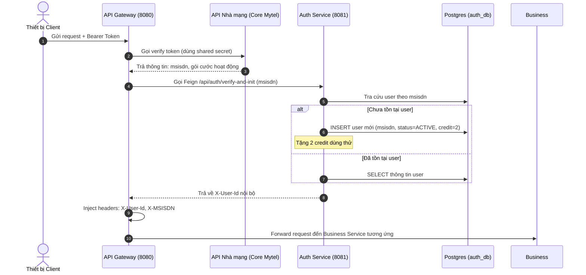
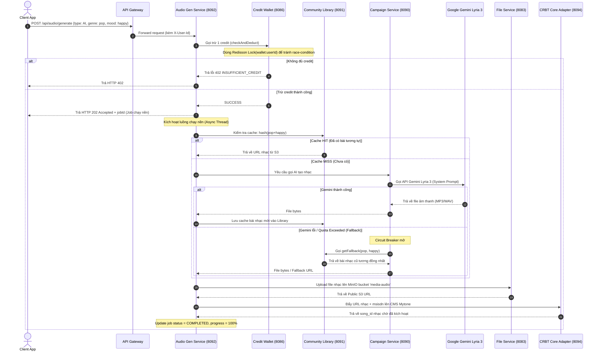
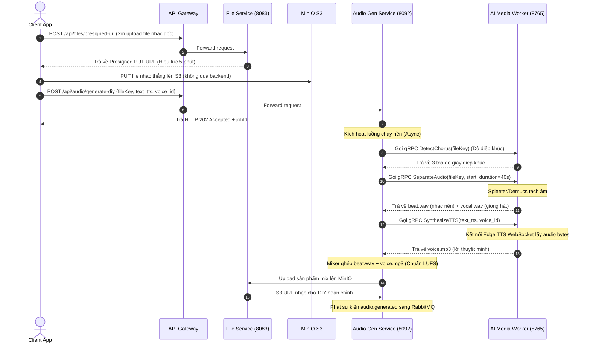

# TÀI LIỆU BÀN GIAO BACKEND SPECIFICATION

Tài liệu này mô tả chi tiết kiến trúc phần mềm, danh sách module, các luồng xử lý nghiệp vụ chính, cấu hình kết nối hạ tầng, cơ chế xác thực và xử lý lỗi thuộc layer Backend của hệ thống **Mytel CRBT Microservice Platform**.

---

## 1. Công Nghệ & Framework Sử Dụng

Kiến trúc Backend được thiết kế theo mô hình Microservice phân tán, chia thành 2 phần chính: Hệ sinh thái Java Spring Boot cho nghiệp vụ/điều phối và Python Worker cho xử lý AI chuyên sâu.

| Thành phần | Công nghệ / Phiên bản | Ghi chú |
|---|---|---|
| **Ngôn ngữ chính** | Java 21 (Eclipse Temurin) | Sử dụng tính năng mới của Java 21 như Virtual Threads, Pattern Matching |
| **Framework chính** | Spring Boot 3.2.5 | Quản lý vòng đời ứng dụng, DI/IoC |
| **Quản lý Dependency**| Apache Maven 3.9+ | Cấu trúc Maven Multi-module quản lý tập trung |
| **Công nghệ Python** | Python 3.11 · FastAPI · gRPC | Phục vụ xử lý tín hiệu âm thanh và tích hợp AI |
| **Giao tiếp nội bộ** | Spring Cloud OpenFeign & gRPC | Feign cho REST sync nội bộ; gRPC cho truyền tải binary dữ liệu âm thanh hiệu năng cao |
| **Giao tiếp bất đồng bộ**| RabbitMQ 3.12 (AMQP) | Truyền tin tức thời, điều phối sự kiện giữa các service |
| **Cơ sở dữ liệu** | PostgreSQL 16 | Thiết kế độc lập: mỗi service sở hữu 1 DB riêng biệt |
| **Cache & Lock** | Redis 7.2 + Redisson 3.2x | Cache kết quả AI và khóa phân tán (Distributed Lock) |
| **Lưu trữ file** | MinIO (S3-compatible API) | Lưu trữ file nhạc gốc, vocal, beat và kết quả hoàn chỉnh |

---

## 2. Danh Sách Module / Service

Hệ thống bao gồm **13 module/service** được chia thành 4 tầng kiến trúc rõ rệt:

```
Tài liệu bàn giao Backend (Thư mục gốc)
├── common/ (LAYER CHIA SẺ SDK)
│   ├── common-core (Chuẩn hóa Response, Exception, Circuit Breaker)
│   ├── common-security (Xử lý Context xác thực nội bộ)
│   ├── common-ai-sdk (System Prompt Lyria và Metadata TTS)
│   └── common-rmq (Cấu hình RabbitMQ Retry & DLQ)
├── infrastructure/ (LAYER ĐIỀU PHỐI HẠ TẦNG)
│   ├── eureka-server (Đăng ký và phát hiện dịch vụ)
│   ├── config-server (Cấu hình tập trung)
│   └── api-gateway (Cổng định tuyến, Rate Limit, CORS, Validate JWT)
├── infra-services/ (LAYER PLATFORM CORE)
│   ├── auth-service (Đăng ký, Đăng nhập, Token Lifecycle)
│   ├── file-service (Quản lý Storage S3, Presigned URL)
│   ├── notification-service (Gửi SMS/Email qua RabbitMQ)
│   ├── audit-log-service (Lưu vết hành vi bảo mật)
│   ├── payment-gateway-service (Tích hợp Charging Core MPS)
│   └── credit-wallet-service (Quản lý số dư credit tạo nhạc)
├── business-services/ (LAYER NGHIỆP VỤ CRBT)
│   ├── crbt-campaign-service (Quản lý gói cước, quota Lyria)
│   ├── crbt-community-library (Kho nhạc nền, Fallback khi AI lỗi)
│   ├── crbt-credit-transaction-service (Lịch sử giao dịch chi tiết)
│   ├── crbt-core-adapter (Đẩy nhạc lên hệ thống CMS Mytone)
│   └── audio-generation-service (Điều phối luồng DIY/TTS, Async Job)
└── python-services/ (LAYER AI WORKER)
    └── ai-media-worker (FastAPI + gRPC tách beat, điệp khúc, Edge TTS)
```

### Chi tiết các Service

| STT | Service Name | Cổng (Port) | Layer | Vai trò chi tiết |
|---|---|---|---|---|
| 1 | **api-gateway** | 8080 | Infrastructure | Cổng duy nhất tiếp nhận request từ client. Thực hiện validate JWT, Rate limiting (Redis Token Bucket), và inject thông tin user vào header. |
| 2 | **eureka-server** | 8761 | Infrastructure | Service Registry để các service đăng ký IP/Port và tìm kiếm nhau một cách tự động. |
| 3 | **config-server** | 8888 | Infrastructure | Cung cấp cấu hình tập trung cho toàn bộ service (đọc từ local filesystem hoặc Git repository). |
| 4 | **auth-service** | 8081 | Infra-Services | Quản lý người dùng, mã hóa mật khẩu (BCrypt), cấp phát JWT (Access Token & Refresh Token rotation). |
| 5 | **notification-service**| 8082 | Infra-Services | Consumer lắng nghe RabbitMQ để gửi SMS/Email thông báo bất đồng bộ (chào mừng, mã OTP, thành công...). |
| 6 | **file-service** | 8083 | Infra-Services | Tích hợp MinIO SDK. Cấp phát Presigned URL phục vụ upload trực tiếp từ client lên S3 nhằm giảm tải backend. |
| 7 | **audit-log-service** | 8084 | Infra-Services | Ghi nhật ký bảo mật độc lập qua hàng đợi RabbitMQ (không chặn luồng xử lý chính). |
| 8 | **payment-gateway-service**| 8085 | Infra-Services | Cổng trừ cước viễn thông tích hợp trực tiếp qua API Charging Core (MPS) của nhà mạng. |
| 9 | **credit-wallet-service**| 8086 | Infra-Services | Quản lý ví tín dụng ảo. Dùng Redisson Lock để đảm bảo tính nhất quán dữ liệu ví khi trừ tiền song song. |
| 10 | **crbt-campaign-service**| 8090 | Business | Quản lý gói cước và điều phối gọi Google Gemini Lyria 3 API tạo nhạc. |
| 11 | **crbt-community-library**| 8091 | Business | Kho lưu trữ nhạc chờ cộng đồng. Thực hiện cache kết quả tạo AI và chạy thuật toán lấy nhạc cũ thay thế khi AI lỗi. |
| 12 | **audio-generation-service**| 8092 | Business | Trung tâm điều phối luồng tạo nhạc. Quản lý trạng thái tiến trình (progress %), gọi gRPC sang Python worker. |
| 13 | **crbt-credit-transaction-service**| 8093 | Business | Lưu trữ dòng tiền chi tiết, phục vụ đối soát cước tài chính (Immutable logs). |
| 14 | **crbt-core-adapter** | 8094 | Business | Chuyển đổi nhạc chờ sang codec chuẩn viễn thông và đẩy lên hệ thống CMS Mytone của nhà mạng. |
| 15 | **ai-media-worker** | 8765 | Python AI | FastAPI + gRPC server thực hiện tính toán: Tách nguồn âm (Demucs), Dò điệp khúc (spectrogram SSM), Edge TTS. |

---

## 3. Các Luồng Xử Lý Nghiệp Vụ Chính

### 3.1 Luồng Xác Thực và Tạo User (Lazy Loading)

Khi thuê bao gọi API qua ứng dụng nhà mạng, hệ thống không bắt họ đăng ký. Thay vào đó, API Gateway sẽ verify token với nhà mạng, sau đó tự động tạo tài khoản ngầm ở hệ thống thông qua cơ chế **Lazy Loading**.



---

### 3.2 Luồng Tạo Nhạc Bằng Trí Tuệ Nhân Tạo (Module A - AI Music)



---

### 3.3 Luồng Tự Tạo Nhạc (Module B - DIY Music Flow)

Luồng này cho phép người dùng tự tải nhạc của họ lên, tách lời và nhạc nền, rồi ghép giọng đọc nhân tạo (TTS) vào để làm nhạc chờ độc đáo.



---

## 4. Tác Vụ Chạy Ngầm (Scheduler / Job)

Hệ thống có hai luồng xử lý chạy nền/ngầm chính:

### 4.1 Tiến Trình Gia Hạn Gói Cước Tự Động (Auto-Renew Subscription)
- **Vị trí**: Nằm trong `crbt-campaign-service`.
- **Cơ chế**: Sử dụng `@Scheduled(cron = "0 0 0 * * ?")` chạy vào **00:00:00 hàng đêm**.
- **Luồng hoạt động**:
  1. Quét bảng `user_subscriptions` tìm các thuê bao có `expires_at` trong ngày hiện tại và có cờ `auto_renew = true`.
  2. Gom nhóm và gọi sang `payment-gateway-service` để kích hoạt yêu cầu trừ cước trên Core Charging nhà mạng.
  3. Nếu trừ cước thành công (nhận webhook `SUCCESS`), tiến hành cộng credit vào ví qua `credit-wallet-service` và cập nhật `expires_at` thêm chu kỳ mới (ví dụ: +1 ngày cho gói ngày).
  4. Nếu trừ cước thất bại, chuyển trạng thái subscription thành `EXPIRED` và đẩy thông báo SMS cảnh báo qua RabbitMQ.

### 4.2 Tiến Trình Xử Lý Tạo Nhạc Bất Đồng Bộ (Async Audio Generation)
- **Vị trí**: Nằm trong `audio-generation-service`.
- **Cấu hình Thread Pool**:
  - `corePoolSize = 10`
  - `maxPoolSize = 30`
  - `queueCapacity = 200`
- **Cơ chế**: Khi client gửi yêu cầu tạo nhạc (AI hoặc DIY), Main Thread nhận request, lưu Job vào DB với status = `PENDING` và trả ngay HTTP Code `202 Accepted` kèm `jobId`. Logic xử lý chính được đánh dấu `@Async("audioJobExecutor")` chạy độc lập trên một Worker Thread:
  - Cập nhật tiến trình (`progress`) liên tục vào Redis: `job:{jobId}:progress` (10% -> 30% -> 70% -> 100%).
  - Client gọi API polling `GET /api/audio/job/{jobId}/status` để đọc tiến trình và hiển thị loading bar trên giao diện.

---

## 5. Cấu Hinh Kết Nối Hạ Tầng

### 5.1 Cấu Hình Cơ Sở Dữ Liệu (PostgreSQL Connection Pool)
Mỗi service Java Spring Boot kết nối PostgreSQL qua thư viện **HikariCP** với các tham số tối ưu sau:
```yaml
spring:
  datasource:
    hikari:
      minimum-idle: 5
      maximum-pool-size: 30
      idle-timeout: 30000
      max-lifetime: 1800000
      connection-timeout: 20000
      pool-name: HikariCP-Platform-Pool
```

### 5.2 Cấu Hình Redis & Khóa Phân Tán (Redisson)
- **Redis Cache**: Dùng để lưu thông tin cấu hình, danh sách bài hát nổi bật và cache nhạc AI. TTL mặc định là `86400 giây (24 giờ)`.
- **Redisson Lock**: Dùng cấu hình khóa phân tán bảo vệ ví tín dụng khi thực hiện giao dịch:
  ```java
  RLock lock = redissonClient.getLock("wallet:" + userId);
  try {
      if (lock.tryLock(3, 10, TimeUnit.SECONDS)) { // Chờ tối đa 3s, tự giải phóng sau 10s
          // Thực hiện trừ số dư credit
      }
  } finally {
      if (lock.isHeldByCurrentThread()) {
          lock.unlock();
      }
  }
  ```

### 5.3 Quy Hoạch Mạng Lưới Hàng Đợi (RabbitMQ Exchanges & Queues)
Hệ thống sử dụng **Topic Exchange** có tên là `crbt.event.exchange`.

| Tên Hàng Đợi (Queue) | Routing Key | Service Consumer | Mục đích |
|---|---|---|---|
| `q.notification.sms` | `notification.sms.#` | `notification-service` | Gửi tin nhắn SMS chào mừng, mã OTP, gia hạn. |
| `q.audit.log` | `audit.event.#` | `audit-log-service` | Ghi log hoạt động người dùng và hệ thống. |
| `q.credit.transaction` | `credit.changed.#` | `crbt-credit-transaction-service` | Lưu vết biến động ví phục vụ đối soát tài chính. |
| `q.adapter.activate` | `audio.activated.#` | `crbt-core-adapter` | Đồng bộ dữ liệu nhạc chờ sang CMS Mytone nhà mạng. |

*Mỗi Queue đều được cấu hình cơ chế **Dead Letter Queue (DLQ)**: Khi một message xử lý thất bại 3 lần liên tiếp (kèm khoảng cách retry exponential backoff: 1s, 2s, 4s), nó sẽ tự động chuyển vào Exchange `dlx.crbt.exchange` và đẩy vào Queue `q.dlq.<name>` để kỹ thuật viên kiểm tra thủ công.*

---

## 6. Cơ Chế Xác Thực Hệ Thống

Kiến trúc bảo mật của hệ thống hoạt động theo mô hình **Gateway Token Verification & Internal Trusted Headers**:

1. **Xác thực tại API Gateway**:
   - Gateway nhận request của client có header `Authorization: Bearer <JWT_TOKEN>`.
   - Gateway giải mã và kiểm tra tính hợp lệ của token (chữ ký mã hóa, thời gian hết hạn).
   - Nếu token hợp lệ, Gateway trích xuất thông tin người dùng: `userId`, `email`, `roles`.
   - Gateway thêm các header đặc biệt trước khi chuyển tiếp (forward) xuống microservice nội bộ:
     - `X-User-Id`: ID người dùng trong hệ thống.
     - `X-User-Email`: Email người dùng.
     - `X-User-Roles`: Vai trò người dùng (ví dụ: `ROLE_USER`, `ROLE_ADMIN`).
     - `X-MSISDN`: Số điện thoại thuê bao (nếu có).

2. **Tin tưởng nội bộ (Internal Trust)**:
   - Các microservice nội bộ không mở cổng ra ngoài Internet (được bảo vệ trong mạng nội bộ Docker/VPC).
   - Module `common-security` chứa một Filter bảo mật (`JwtAuthenticationFilter`) được nhúng trong các service nội bộ.
   - Filter này chỉ cần đọc trực tiếp các header `X-User-*` do API Gateway gửi xuống để nạp vào `SecurityContextHolder` của Spring Security:
     ```java
     String userId = request.getHeader("X-User-Id");
     String roles = request.getHeader("X-User-Roles");
     if (userId != null) {
         UsernamePasswordAuthenticationToken auth = new UsernamePasswordAuthenticationToken(
             userId, null, AuthorityUtils.commaDelimitedListToAuthorities(roles)
         );
         SecurityContextHolder.getContext().setAuthentication(auth);
     }
     ```
   - Điều này giúp giảm thiểu thời gian giải mã token nhiều lần ở từng service (giảm latency).

---

## 7. Giám Sát Nhật Ký & Danh Sách Mã Lỗi

### 7.1 Thu Thập Log Tập Trung (Grafana Loki & Promtail)
- Toàn bộ log của 13 service được in ra console dạng chuẩn JSON.
- **Promtail** chạy ngầm dưới dạng container thu gom tất cả log từ các Docker container khác và đẩy trực tiếp lên **Grafana Loki**.
- Kỹ thuật viên truy cập Grafana Dashboard tại cổng `3001` để tìm kiếm và lọc log tập trung theo `service_name`, `trace_id` hoặc khoảng thời gian mà không cần SSH vào server.

### 7.2 Định Dạng Lỗi Chuẩn Hóa
Tất cả các exception xảy ra trong hệ thống đều được bắt tại `@RestControllerAdvice` trong module `common-core` và đóng gói thành định dạng JSON chuẩn:
```json
{
  "code": "ERROR_CODE",
  "message": "Thông tin chi tiết về lỗi hiển thị cho người dùng/kỹ thuật",
  "timestamp": "2026-06-18T15:30:00Z"
}
```

### 7.3 Danh Sách Mã Lỗi Nghiệp Vụ Cốt Lõi

| Mã Lỗi (Error Code) | HTTP Status | Định nghĩa | Hướng xử lý |
|---|---|---|---|
| `AUTH_INVALID_CREDENTIALS` | 401 | Nhập sai email hoặc mật khẩu | Yêu cầu người dùng nhập lại |
| `AUTH_ACCOUNT_LOCKED` | 403 | Tài khoản bị khóa (trạng thái khác ACTIVE) | Liên hệ Admin để mở khóa |
| `INSUFFICIENT_CREDIT` | 402 | Ví không đủ số dư credit để tạo nhạc AI/DIY | Gợi ý người dùng đăng ký gói cước |
| `TOO_MANY_JOBS` | 429 | Người dùng vượt quá giới hạn 5 job tạo nhạc chạy song song | Chờ job hiện tại hoàn thành rồi thử lại |
| `AI_UNAVAILABLE` | 503 | Cả API Gemini Lyria và luồng Fallback đều lỗi | Trả thông báo hệ thống đang bận, thử lại sau |
| `WALLET_LOCKED` | 503 | Lỗi tranh chấp tài nguyên ví khi lấy lock Redisson quá 3 giây | Tự động retry ngầm từ client sau 1-2 giây |
| `FILE_TOO_LARGE` | 400 | File nhạc upload vượt quá giới hạn 5MB | Yêu cầu nén hoặc cắt ngắn file nhạc |
| `INVALID_FILE_TYPE` | 400 | File tải lên không thuộc định dạng whitelist (jpg, png, mp3, wav)| Chỉ chấp nhận định dạng âm thanh/hình ảnh chuẩn |
